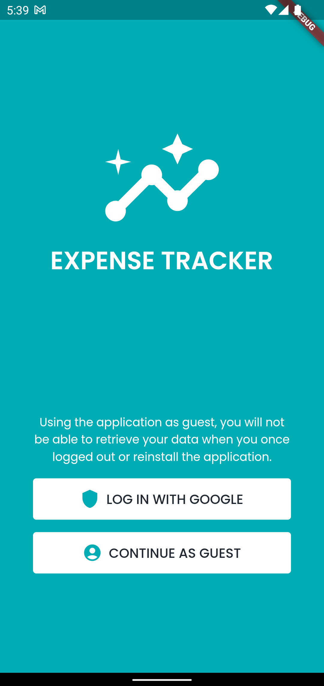
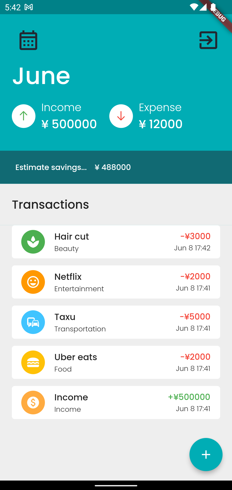
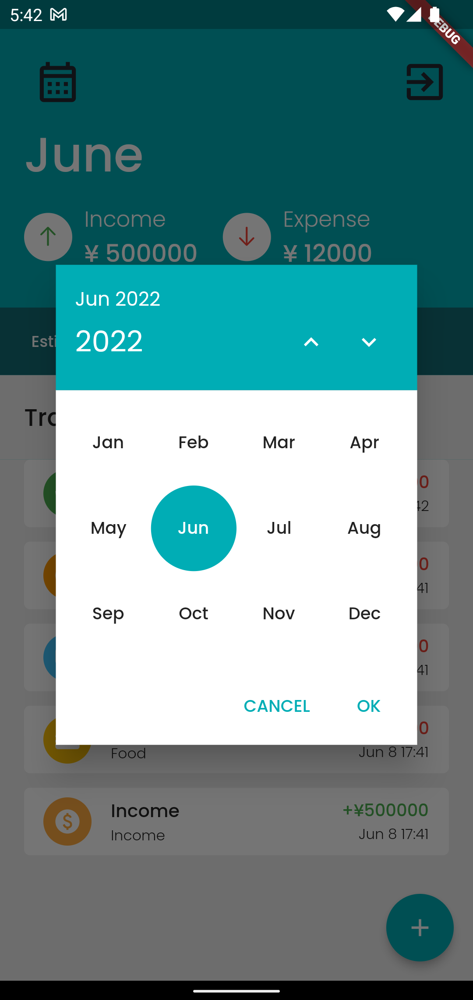
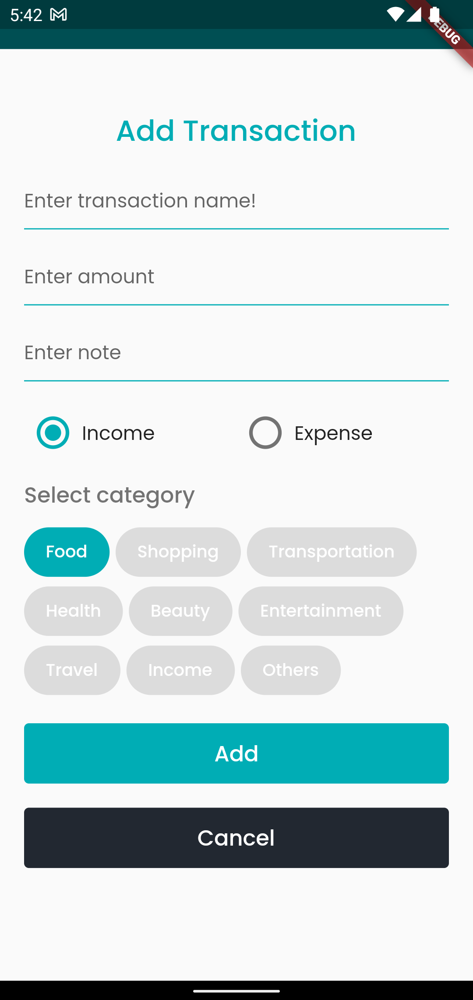

# expense_tracker

Personal expense tracker project with flutter and firebase

|        |        |        |        |
| -------------- | -------------- | -------------- | -------------- |
|||||
|        |        |        |        |

## Prerequisites

- Install Xcode
- Install AndroidStudio
- [Install flutter version manager for flutter sdk](https://fvm.app/docs/getting_started/installation)
- Install lefthook using  ```brew install lefthook``` or ```npm i @arkweid/lefthook```

## SetUp

```bash
### clone project
- git clone git@github.com:AungMyoMin196/expense-tracker.git
### install flutter sdk via fvm
- fvm install 3.0.1 
### cd to project directory
- cd expense-tracker
### init flutter sdk
- fvm use 3.0.1
### init lefthook
- lefthook install
```

## Run project

```bash
.fvm/flutter_sdk/bin/flutter run --target lib/main_development.dart --flavor development
```
